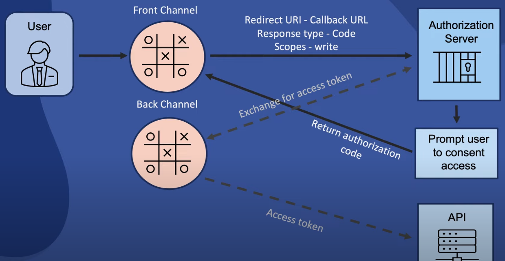
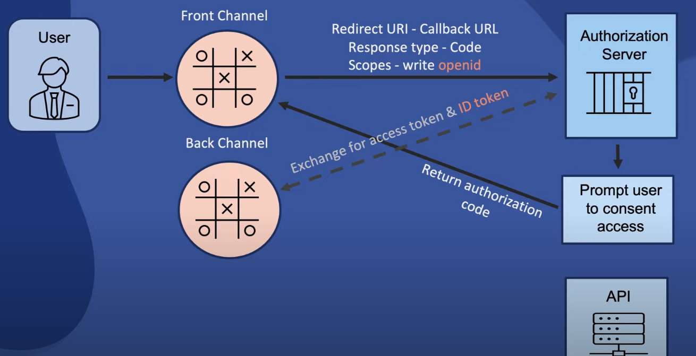
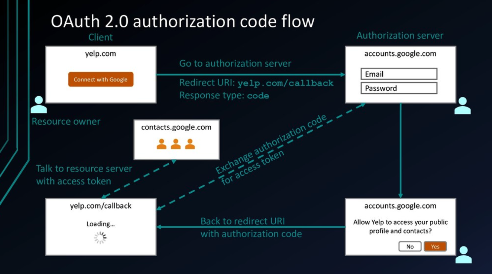
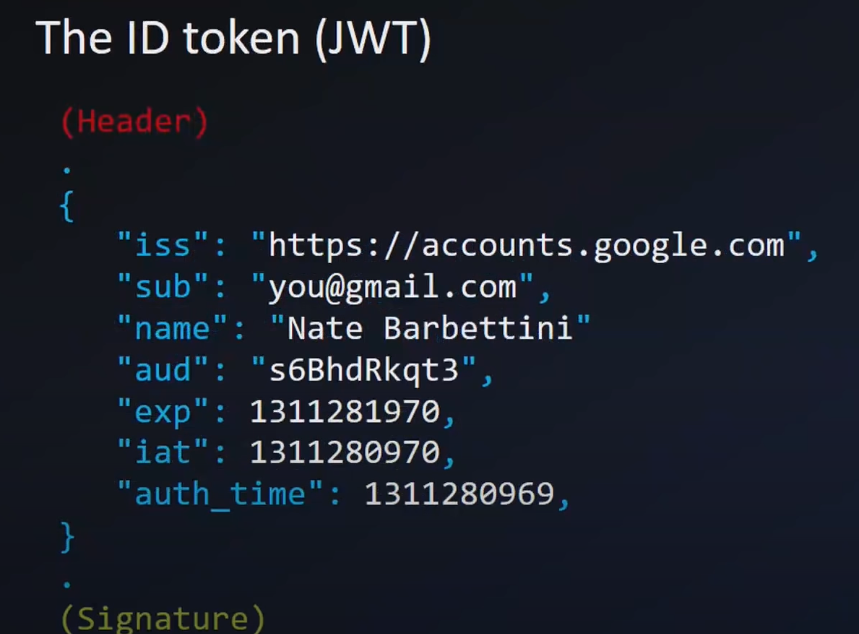
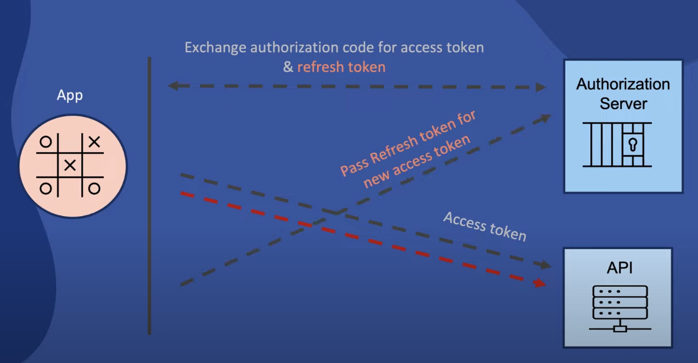

## Web API Security

### 1. Authentication vs Authorization

 * Authentication - verifying who you are
 * Authorization - verifying what are you allowed to do, what resources you are allowed to access

``OAuth - allows users to grant access to applications without having to share password with them.``
* no password sharing
* revoke access to applications individually
* granular access to resources - Oauth is about to limiting access to resources.

    

Access token which is provided by oauth was never meant to verify user authentication. It was only meant to provide permissions info.

Authentication is done by OpenID Connect:

   

### 2. Simple login
shese problems.

### 3. OAuth 2.0 - terminology
* resource owner (users who log in)
* client (application)
* authorization server - system that can be used to auth permission (like google/fb/twitter)
* resource server - api - system that holds data that client wants to get to(like fb friends) - sometimes it might be same server as auth server
* authorization grant - thing that proves that permission is granted
* redirect uri - callback 
* access token
* scope - list of permissions - initial request from the client includes scope details
* consent - authorization server requests consent from resource owner

* back channel - higly secure channel(dashed line on the photo) -> exchange auth code for access token
* front channel - less secure channel(solid line on the photo)

### 4. Starting the flow

* https://accounts.google.com/o/oauth2/v2/auth?
    * client_id=anc123&
    * redirect_uri
    * scope
    * response_type
    * state

### 5. Problems with Oauth 2.0 for authentication

* no standard way to get user's information
* every implementation is a little different
* no common set of scopes

    Oauth should NOT be used for authentication. You don't get user's information in oauth. It is for authorization and for permissions.

### 6. OpenID Connect

``OpenID is simple identity layer on top of the OAuth 2.0 protocol. It allows Clients to verify the identity of the End-User based on the authentication performed by an Authorization Server.``

OpenID provides:

* ID token
* UserInfo enpoint for getting more user information
* standard set of scopes
* standarized implementation

    After decoding JWT you get below info:
    
    

    OpenID can  verified if this signuture was changed/compromised etc.

### 7. Identity use cases(today):

* simple login(OpenID Connect) **authentication**
* Single sign-on across sites(OpenID Connect) **authentication**
* Mobile app login(OpenID Connect) **authentication**
* Delegated authorization(OAuth 2.0) **authorization**

### 8. OAuth 2 vs OpenID Connect

| **OAuth** | **OpenID Connect** |
| --- | --- | 
| Granting access to your API | Logging user in  |
|Getting access to user data in other systems| Making your account available in other systems|
|(Authorization)|(Authentication)|

### 9. Scopes 

``Scopes are used to limit an applicartion's access to user data. ``

### 10. Refresh Token

``Refresh token allows access tokens to be renewed. ``

   
